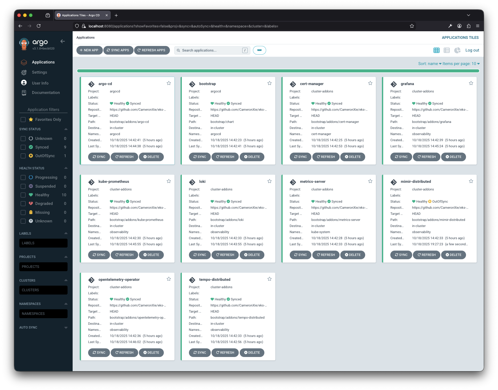
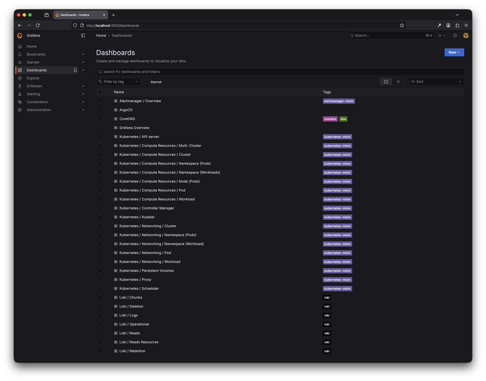

# EKS Explorer

[](https://github.com/CameronXie/eks-explorer/actions/workflows/test.yaml)

A comprehensive reference implementation for exploring and building production-ready Amazon EKS infrastructure with
enterprise-grade add-ons, observability, and GitOps workflows.

## Overview

EKS Explorer demonstrates practical patterns and best practices for deploying and operating production Kubernetes
clusters on AWS. The project provides a complete, end-to-end solution encompassing infrastructure provisioning, cluster
configuration, add-on management, and operational observability.

Built on proven technologies, Terraform for infrastructure as code, ArgoCD for GitOps-based delivery, and the LGTM stack
for comprehensive observability, this project serves as both a learning resource and a foundation for production
deployments. The modular architecture supports incremental adoption and customization, allowing teams to adapt the
implementation to their specific requirements while maintaining operational best practices.

## Architecture

### Infrastructure Stacks

The project is organized into three Terraform stacks:

#### 1. Platform Stack (`infrastructure/platform`)

Responsible for foundational AWS infrastructure and EKS cluster setup:

- **VPC Configuration**: Complete networking setup including:
    - Public and private subnets across multiple availability zones
    - NAT gateways for private subnet internet access
    - Route tables and internet gateway
- **EKS Cluster**: Managed Kubernetes cluster with:
    - Configurable Kubernetes version
    - Managed node groups with auto-scaling
    - Essential cluster add-ons (VPC CNI, CoreDNS, kube-proxy, EBS CSI driver)
    - Pod Identity Agent for workload IAM authentication
- **IAM Configuration**: Pod Identity associations for secure AWS service access
- **CloudWatch Integration**: Cluster logging for audit and diagnostic purposes

#### 2. Addons Stack (`infrastructure/addons`)

Manages AWS resources required for cluster add-ons and observability:

- **Modular Add-on Architecture**: Each add-on is implemented as a separate Terraform module with enable/disable flags
- **LGTM Stack AWS Resources**:
    - **Loki**: S3 buckets for log storage (chunks, ruler, admin)
    - **Mimir**: S3 buckets for metrics storage (blocks, ruler, alertmanager)
    - **Tempo**: S3 bucket for distributed tracing data
- **IAM Roles and Policies**: Pod Identity configurations for each observability component
- **SSM Parameter Store**: Stores infrastructure values (S3 bucket names, IAM roles) for GitOps stack consumption
- **ArgoCD Bootstrap**: Initial ArgoCD installation using Helm provider with lifecycle management

#### 3. GitOps Stack (`infrastructure/gitops`)

Implements GitOps workflows using ArgoCD Terraform provider:

- **ArgoCD Projects**: Separates concerns with dedicated projects for ArgoCD management and cluster add-ons
- **Bootstrap Application**: Implements app-of-apps pattern to deploy all cluster add-ons
- **AWS Resource Integration**: Retrieves S3 bucket names from SSM and injects into Helm values
- **Automated Sync Policies**: Configures automated pruning, self-healing, and retry logic

### Cluster Add-ons and GitOps Delivery

The project uses ArgoCD's app-of-apps pattern to deploy and manage all cluster add-ons declaratively. A bootstrap
application orchestrates the deployment of child applications, ensuring proper sequencing and dependency management:

**Foundation Components**

- **cert-manager** - Automates TLS certificate lifecycle management with support for ACME protocols and multiple
  certificate authorities
- **metrics-server** - Collects container resource metrics enabling Horizontal Pod Autoscaler and resource visibility
  via kubectl

**Observability Infrastructure**

- **kube-prometheus** - Production-ready monitoring stack with Prometheus Operator, Alertmanager, node exporters, and
  Kubernetes-native dashboards
- **opentelemetry-operator** - Deploys and manages OpenTelemetry Collectors for standardized telemetry collection,
  transformation, and routing
- **loki** - Cloud-native log aggregation system with multi-tenancy support and cost-effective S3 storage backend
- **tempo-distributed** - High-throughput distributed tracing backend enabling end-to-end request flow analysis
- **mimir-distributed** - Scalable, long-term Prometheus metrics storage with horizontal scalability and multi-tenancy
- **grafana** - Unified visualization platform correlating metrics, logs, and traces through pre-configured dashboards
  and data source integrations

**GitOps Platform**

- **argo-cd** - Declarative GitOps continuous delivery controller managing all cluster applications, transitioning to
  self-management after bootstrap

#### Design Considerations

1. **Dynamic ArgoCD Application Generation**:
    - Helm chart named templates (`_helpers.tpl`) dynamically generate ArgoCD Application manifests
    - Reduces boilerplate and ensures consistency across applications

2. **AWS Resource Value Propagation**:
    - GitOps stack passes AWS resource values (S3 buckets) to the bootstrap app-of-apps via Helm values
    - Individual applications read these values from parent chart values
    - Enables dynamic configuration without hardcoding infrastructure details

3. **Environment-Specific Configuration**:
    - Terraform variables: `environments/{env_name}/infrastructure/{stack}.tfvars`
    - Helm values: `environments/{env_name}/bootstrap/addons/{addon}.yaml`
    - Allows per-environment customization while maintaining common templates

4. **Sync Wave Ordering**:
    - Applications are deployed in a specific order using ArgoCD sync waves:
        - Wave 1: cert-manager (certificate management)
        - Wave 2: metrics-server (cluster metrics)
        - Wave 10: kube-prometheus (monitoring foundation)
        - Wave 20: LGTM stack (observability backends)
        - Wave 30: opentelemetry-operator (telemetry collection)
        - Wave 40: grafana (visualization)
        - Wave 100: argo-cd (self-management)

5. **Self-Managed ArgoCD**:
    - ArgoCD is initially installed via Terraform Helm provider
    - Subsequently managed by itself as an ArgoCD application
    - Terraform lifecycle ignores changes after initial deployment

## Observability Stack

### Components

- **Loki**: Log aggregation and querying
- **Grafana**: Unified visualization and dashboards
- **Tempo**: Distributed tracing backend
- **Mimir**: Long-term metrics storage
- **Kube-Prometheus**: Kubernetes cluster monitoring (Prometheus, Alertmanager)
- **OpenTelemetry Operator**: Telemetry collection and processing

### Features

- **Pre-configured Dashboards**: Grafana dashboards for OpenTelemetry Collector metrics and cluster observability
- **OpenTelemetry Collector**: Custom collector configuration with OTLP receivers and exporters
- **S3 Storage**: Long-term storage for logs, metrics, and traces with lifecycle policies
- **Pod Identity Integration**: Secure AWS service access without static credentials

## Prerequisites

- **AWS CLI**: Configured with appropriate credentials
- **Terraform**: Version 1.5 or higher
- **Docker & Docker Compose**: For local development environment
- **kubectl**: Kubernetes command-line tool
- **ArgoCD CLI**: For ArgoCD management
- **tflint**: Terraform linting tool

## Getting Started

### 1. Local Development Environment

The project provides a Docker-based development environment with all required tools:

```bash
# Create .env file from template
make create-dev-env

# Start development environment
make up

# Stop development environment
make down
```

### 2. Configure Environment

Create environment-specific configuration files:

```bash
environments/
└── dev
    ├── bootstrap
    │   └── addons                        # Helm values for add-ons
    │       ├── loki.yaml
    │       ├── mimir-distributed.yaml
    │       └── tempo-distributed.yaml
    └── infrastructure                    # Terraform variables
        ├── addons.tfvars
        ├── gitops.tfvars
        └── platform.tfvars
```

### 3. Deploy Infrastructure and Applications

The deployment process provisions AWS infrastructure (VPC, EKS, S3 buckets), installs ArgoCD, and bootstraps the
app-of-apps pattern to deploy all cluster add-ons automatically.

```bash
# Deploy all stacks sequentially
make deploy ENV=dev
```

### 4. Configure kubectl Access

```bash
make setup-kubeconfig ENV=dev

# Verify kubectl access
kubectl get nodes
```

### 5. Access Services

**ArgoCD UI:**

```bash
kubectl port-forward svc/argocd-server -n argocd 8080:443

# Retrieve admin password
make argocd-secret

# Open https://localhost:8080
```



**Grafana Dashboards:**

```bash
kubectl port-forward svc/grafana -n observability 3000:80

# Retrieve admin password
make grafana-secret

# Open http://localhost:3000
```



## Cleanup

Destroy infrastructure in reverse order to handle dependencies:

```bash
# Remove GitOps applications
make destroy-tf STACK=gitops ENV=dev

# Remove AWS resources for add-ons
make destroy-tf STACK=addons ENV=dev

# Remove EKS cluster and VPC
make destroy-tf STACK=platform ENV=dev
```
